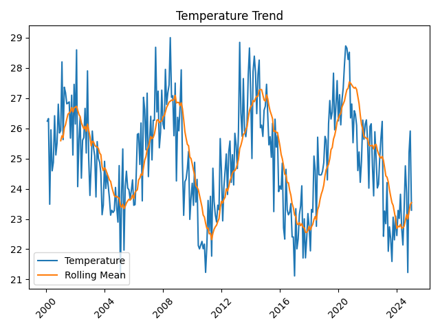
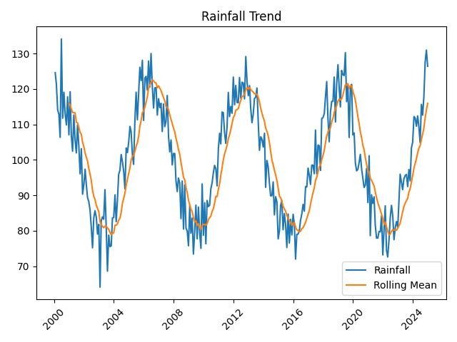
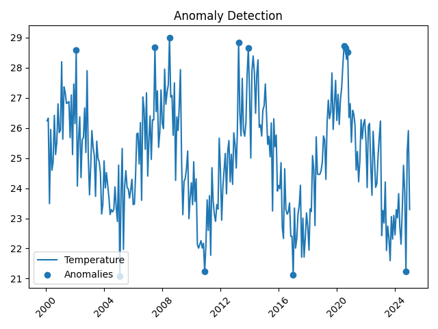

# 🌍 Climate Trend Analyzer

## 📌 Project Overview

The Climate Trend Analyzer is a data science project that analyzes historical climate data to identify trends, detect anomalies, and forecast future climate patterns.

---

## 🚀 Features

* 📊 Temperature & Rainfall Trend Analysis
* 📈 Rolling Mean Smoothing
* ⚠️ Anomaly Detection (Z-score method)
* 🔮 Future Temperature Forecasting
* 📉 Data Visualization (Matplotlib)

---

## 🏭 Industry Relevance

This project simulates real-world climate analytics used by:

* Environmental agencies
* Government policy makers
* Agritech companies
* Climate-tech startups

---

## 🛠 Tech Stack

* Python
* Pandas, NumPy
* Matplotlib
* Scikit-learn

---

## 📂 Project Structure

```bash
Climate-Trend-Analyzer/
├── data/
├── src/
├── outputs/
├── images/
├── main.py
└── README.md
```

---

## ⚙️ Installation

```bash
python -m venv venv
venv\Scripts\activate
pip install -r requirements.txt
```

---

## ▶️ Run the Project

```bash
python main.py
```

---

## 📊 Outputs

### Temperature Trend



### Rainfall Trend



### Anomaly Detection



---

## 🔮 Forecast Output

Example:

```
2030: 24.33 °C
2040: 23.98 °C
2050: 23.63 °C
```

---

## 📁 Output Files

* Graphs → `outputs/graphs/`
* Anomalies → `outputs/tables/anomalies.csv`

---

## 📚 Learning Outcomes

* Time-series analysis
* Data preprocessing
* Statistical anomaly detection
* Forecasting using regression
* Data visualization

---

## 🔮 Future Improvements

* Real-world dataset integration (NASA/Kaggle)
* Streamlit dashboard
* ARIMA forecasting
* CO₂ correlation analysis

---

## 👨‍💻 Author

Your Name
Muktai Vyawahare